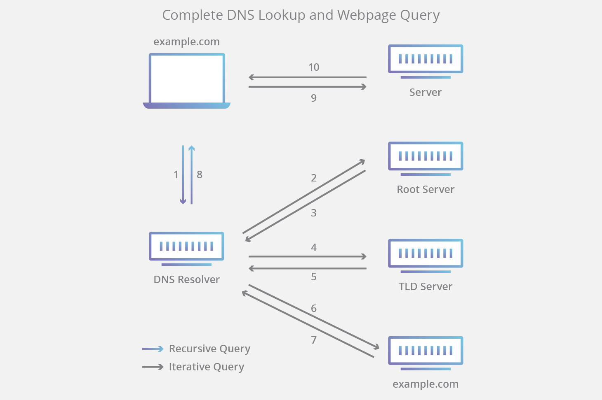

# 域名和DNS

网域名称（英語：Domain Name，简称：Domain），简称域名、网域，是由一串用点分隔的字符组成的互联网上某一台计算机或计算机组的名称，用于在数据传输时标识计算机的电子方位。域名可以说是一个IP地址的代稱，目的是为了便于记忆后者。

域名的核心是域名系统（英語：Domain Name System，缩写：DNS），域名系统中的任何名称都是域名。在域名系统的层次结构中，各种域名都隶属于域名系统根域的下级。域名的第一级是顶级域，它包括通用顶级域，例如`.com`、`.net`和`.org`；以及国家和地区顶级域，例如`.us`、`.cn`和`.tk`。顶级域名下一层是二级域名，一级一级地往下。现在，还有一些新兴的中文域名，例如`.在线`等。这些域名向人们提供注册服务，人们可以用它创建公开的互联网资源或运行网站。顶级域名的管理服务由对应的域名注册管理机构（域名注册局）负责，注册服务通常由域名注册商负责。

## DNS查找的8个步骤

1. 用户在 Web 浏览器中键入 “example.com”，查询传输到 Internet 中，并被 DNS 递归解析器接收。
2. 接着，解析器查询 DNS 根域名服务器。
3. 然后，根服务器使用存储其域信息的顶级域（TLD）DNS 服务器（例如 .com 或 .net）的地址响应该解析器。在搜索 example.com 时，我们的请求指向 .com TLD。
4. 然后，解析器向 .com TLD 发出请求。
5. TLD 服务器随后使用该域的域名服务器 example.com 的 IP 地址进行响应。
6. 最后，递归解析器将查询发送到域的域名服务器。
7. example.com 的 IP 地址而后从域名服务器返回解析器。
8. 然后 DNS 解析器使用最初请求的域的 IP 地址响应 Web 浏览器。

注意：通常，DNS 查找信息将本地缓存在查询计算机内，或者远程缓存在DNS基础设施内。DNS查找通常有8个步骤。缓存DNS信息时，将从DNS查找过程中跳过一些步骤，从而使该过程更快。