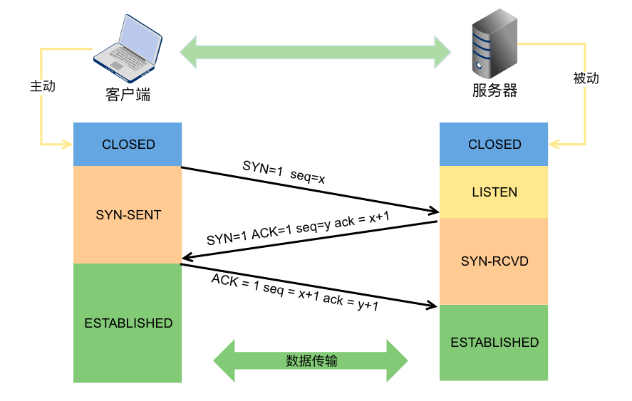
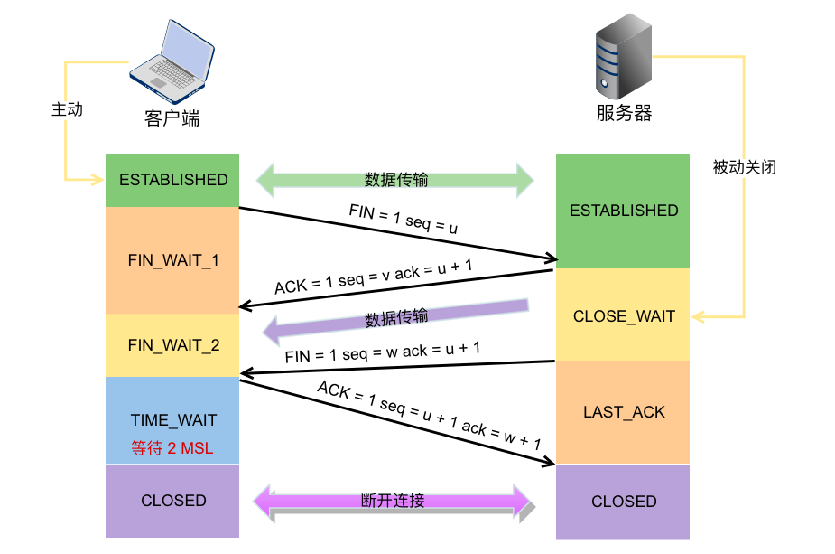

# 计算机网络

`计算机网络`是一个将分散的、具有独立功能的计算机系统，通过通信设备与线路连接起来，由功能完善的软件实现资源共享和信息传递的系统。

计算机网络的主要五大功能：

1. 数据通信
2. 资源共享
3. 分布式处理
4. 提高可靠性
5. 负载均衡

## 分类

计算机网络按照分布范围分类，分成：
1. 广域网（WAN）
2. 城域网（MAN）
3. 局域网（LAN）
4. 个人局域网（PAN）

- VPN（Virtual Private Network）在公用网络上建立专用网络，进行加密通讯。在企业网络中有广泛应用。

## 性能指标

1. `带宽（Bandwidth）`表示网络的通信线路所能传送数据的能力，单位是：“比特每秒”（b/s）
2. `延时（Delay）`是指数据从网络的一段传送到晾一段所需要的总时间，由四个部分组成：发送延时、传播延时、处理延时和排队延时。
3. `时延带宽积`若发送端连续发送数据，在发送的第一个比特即将到达终点时，表示发送端已经发出的比特数。即，时延带宽积 = 传播时延 x 信道带宽
4. `往返时延（Round-Trip Time, RTT）`表示从发送端发送数据开始，到发送端收到来自接收端的确认，总共经历的时延。在互联网中，往返时延还包包括各中间节点的处理时延、排队时延以及传发数据时的发送时延。
5. `吞吐量（Throughput）`表示在单位时间内通过某个网络（或信道、接口）的数据量。吞吐量受网络带宽和网络的额定速率的限制。 
6. `速率（Speed）`网络中的速率是指链接在计算机网络上的主机在数字信道上传送数据的速率，也称为数据率或者比特率，单位是b/s。当数据率较高时，就可以用Kb/s、Mb/s或Gb/s。在计算机网络中，通常吧最高数据率称为带宽。

## 计算机网络分层

### 为什么要做分层？

两个系统中实体间的通信是一个很复杂的过程，为了降低协议设计和调试过程的复杂性，也为了方便于对网络进行研究、实现和维护，促进标准化工作，通常对计算机网络的体系结构以分层的方式进行建模。

### 网络分层的基本原则

1. 每一层都实现一种相对独立的功能，能大大降低系统的复杂度
2. 各层之间界面自然清晰，易于理解，相互交流尽可能少。
3. 各层功能的精确定义独立于具体的实现方法，可以采用最佳的技术来实现。
4. 保持下层对上层的独立性，上层单向使用下层提供的服务。
5. 整个分层结构应能促进标准化工作。

在计算机网络体系结构的各个层次中，每一个报文都分为两个部分，一个是数据部分，也就是SDU，另外一部分是控制信息部分，也就是PCI，他们共同组成PDU。

- `服务数据单元（SDU）`为完成用户所要求的的功能而应传送的数据。第n层的服务数据单元记为n-SDU。
- `协议控制单元（PCI）`控制协议操作的信息。第n层的协议控制单元记为n-PCI。
- `协议数据单元（PDU）`对等层次之间传送的数据单位称为该层的PDU。第n层的协议数据单元称为n-PDU。

在实际的网络中，每层的协议数据单元都有一个通俗的名称，如物理层的PDU叫比特，链路层的PDU叫帧，网络层的PDU叫分组，传输层的PDU叫报文。

在各层间传输数据时，把从第n+1层收到的PUD作为第n层的SDU，加上第n层的PCI，就变成了了第n层的PUD，交给第n-1层后作为SDU发送，接收方接收时做相反的处理。

### ISO/OSI参考模型

1. 应用层
2. 表示层
3. 会话层
4. 传输层
5. 网络层
6. 数据链路层
7. 物理层

###  TCP/IP模型

1. 应用层（用户-用户）
   - HTTP
   - SMTP
   - DNS
   - RTP
2. 传输层（应用-应用）
   - TCP
   - UDP
3. 网际层（主机-主机）
   - IP
4. 网络接口层

## 物理层
## 数据链路层
## 网络层
## 传输层

### IP协议

#### IPv4分组

IPv4，即现在普遍使用的IP协议（版本为4）。IP协议定义数据传送的基本单元——IP分组及其确切的数据格式。

##### IPv4分组的格式

一个IP分组由首部和数据两部分构成。首部的前一部分是固定长度的，共20字节。是所有IP分组必须具有的。在首部固定部分的后面是一些可选字段，其长度是可变的，用来提供错误检测和安全等机制。

##### IP数据报分片

一个链路层数据报能承载的最大数据量称为最大传送单元（MTU）。因为IP数据报被封装在链路层数据报中，故链路层的MTU严格地限制着IP数据报的长度，而且在IP数据报的源与目的地路径上的各段链路可能使用不同的链路层协议，有不同的MTU。例如以太网的MTU为1500字节，而许多广域网的MTU不超过576字节。当IP数据报的总长度大于链路MTU时，就需要将IP数据报中的数据分装在两个或更多个较小的IP数据报中，这些小的数据报叫做片。

当一个路由器需要将一个数据报分片时，形成的每个数据报（即片）都具有原始数据报的`标识号`。

片在目的地的网络层被重新组装。目的主机使用IP首部中的标识、标志和偏移字段来完成对片的组装。

#### IPv4地址与NAT

##### IPv4地址
连接在Internet中的每一台主机（或路由器）都分配一个32比特的全球唯一的标识符，即IP地址。传统的IP地址分为A，B，C，D，E五类。
无论哪种IP地址，都由网络号和主机号两部分组成。

##### NAT
网络地址转换（NAT），是通过将专用网络地址转换为公用地址，从而对外隐藏了内部管理的IP地址。它使得整个专用网只需要一个全球IP地址就可以与因特网连通。由于专用网本地IP地址是可以重用的，所以NAT大大节省了IP地址的消耗。同时，它隐藏了内部网络结构，从而降低了内部网络受到攻击的风险。

为了网络安全，划出了部分IP地址为私有IP地址。私有IP地址只用于LAN，不用于WAN链接，并且允许私有IP地址被LAN重复使用。

- A类：1个A类网段，即10.0.0.0 ~ 10.255.255.255
- B类：16个A类网段，即172.16.0.0 ~ 172.31.255.255
- C类：256个A类网段，即192.168.0.0 ~ 192.168.255.255

在因特网中的所有路由器，对目的地地址是私有地址的数据报一律不进行转发。这种采用私有IP地址的互联网络称为专用互联网或本地互联网。

使用NAT时需要在专用网连接到因特网的路由器上安装NAT软件，NAT路由器至少有一个有效的外部全球地址。当使用本地地址的主机在和外接通信时，NAT路由器使用NAT转换表讲本地地址装换成全球地址，或将全球地址转换成本地地址。NAT转换表中存放着{本地IP地址：端口}到{全球IP地址：端口}的映射。

### TCP协议

#### TCP协议的特点

TCP是在不可靠的IP层之上实现的可靠的数据传输协议，他主要解决传输的可靠、有序、无丢失和不重复的问题。
1. TCP是面向连接的传输层协议。
2. 每一条TCP连接只能有两个端点，每一条TCP连接只能是点对点的链接。
3. TCP提供可靠的交付服务，保证传送的数据无差错、不丢失、不重复且有序。
4. TCP提供全双工通信，TCP允许通信双方的应用进程在任何时候都能发送数据，为此TCP连接的两端都舍友发送缓存和接收缓存，用来临时存放双向通信的数据。
   - 发送缓存用来暂时存放以下数据：
     1. 发送应用程序传送给发送方TCP准备发送的数据
     2. TCP已经发送出但尚未收到确认的数据
   - 接收缓存用来暂时存放以下数据：
     1. 按序到达的但尚未被接收应用程序读取的数据
     2. 不按序到达的数据

#### TCP报文段

TCP传送的数据单元称为报文段。一个TCP报文段分为TCP首部和TCP数据两部分，整个TCP段作为IP数据报的数据部分封装在IP数据报中。

TCP报文段既可以用来运载数据，也可以用来建立连接、释放连接和应答。

#### TCP连接管理

TCP是面向链接的协议。因此每一个TCP连接都有三个阶段：连接建立、数据传送和连接释放。TCP连接的管理就是使运输连接的建立和释放都能正常运行。

TCP把连接作为最基本的抽象，每一条TCP连接都有两个端点，TCP连接的端点不是主机，不是主机的IP地址，不是应用进程，也不是传输层的协议端口。TCP连接的端口叫做套接字（scoket）或插口。端口拼接到IP地址即构成了套接字。

TCP连接的建立采用客户端/服务器的方式。主动发起连接建立的应用进程叫做客户机（Client），而被动等待连接建立的应用进程叫做服务器（Server）。

##### TCP连接的建立

三次握手

`第一步`：客户机的TCP首先向服务器的TCP发送一个连接请求的报文段。这个特殊的报文段中不含应用层数据。起首部中的SYN标志位被置为1。另外，客户机会随机选择一个起始序号seq=x（连接请求报文不携带数据，但要消耗掉一个序号）。

`第二步`：服务器的TCP收到连接请求报文段后，如同意建立连接，就想客户机发回确认，并`为该TCP连接分配TCP缓存和变量`。在确认报文段中，SYN和ACK位都被置为1，确认号字段ack的值为x+1，并且服务器随机产生起始序号seq=y（确认报文不携带数据，但也要消耗掉一个序号）。确认报文同样不包含应用层数据。

`第三步`：当客户机收到确认报文后，还要向服务器给出确认，并且也要给该连接分配缓存和变量。这个报文的ACK字段被置为1，需要字段变为x+1，确认号字段为ack=y+1。该报文可以携带数据，如不携带数据则不消耗序号。

在成功进行了以上三步以后，TCP连接就建立了，接下来就可以传送应用层数据了。

注意，服务端的资源是在完成第二次握手的时候分配的，客户端的资源是在完成第三次握手的时候分配的。这就使得服务器易于收到SYN洪泛攻击。

##### TCP连接的释放

参与TCP连接的两个进程中的任何一个都能终止该连接。TCP的释放过程可以称为“四次挥手”

`第一步`：客户端打算关闭连接，就向其TCP发送一个连接释放的报文段，并停止再发送数据，主动关闭TCP连接，该报文的FIN字段被置为1，seq=u(它等于前面已传送过最后一个字节的序号加1，FIN报文段即使不携带数据，也要消耗掉一个序号)。
TCP是全双工的，即可以想象成是一条TCP上有两条数据通路。当发送FIN报文时，发送FIN的一段就不能再发送数据，也就是关闭了其中一条数据通路，但对方还可以发送数据。

`第二步`：服务器接收到连接释放报文后即发出确认，确认号是ack=u+1，而这个报文段自己的序号是v，它等于前面已传送过最后一个字节的序号加1。此时客户端收到服务器的这个方向的链接就释放了，TCP连接出于`半关闭状态`。单服务器若发送数据，客户机仍要接收，即从服务器到客户机这个方向的连接并未关闭。

`第三步`：若服务器已经没有要向客户机发送的数据，就通知TCP释放连接，此时其发出FIN=1的连接释放报文段。

`第四步`：客户机收到连接释放报文段后，必须发出确认。在确认报文段中，ACK字段被设置为1，确认号ack=w+1，序号seq=u+1，此时TCP连接还没有释放掉，必须经过时间等待计时器设置的时间2MSL后，客户机才进入到连接关闭状态。

#### TCP可靠传输

- 校验
- 序号
- 确认
- 重传