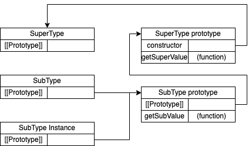

# 继承

### 原型链

ECMA-262把原型链定义为ECMAScript的主要继承方式。其基本思想就是通过原型继承多个引用类型的属性和方法。

实现原型链：

```javascript
function SuperType() {
    this.property = true
}

SuperType.prototype.getSuperValue = function () {
    return this.property
}

function SubType() {
    this.subproperty = false
}

// 继承 SuperType
SubType.prototype = new SuperType()
SubType.prototype.getSubValue = function () {
    return this.subproperty
}

let instance = new SubType()
console.log(instance.getSuperValue())       // true
```


<div align=center></div>

### 盗用构造函数

### 组合继承

### 原型式继承

### 寄生式继承

### 寄生组合式继承