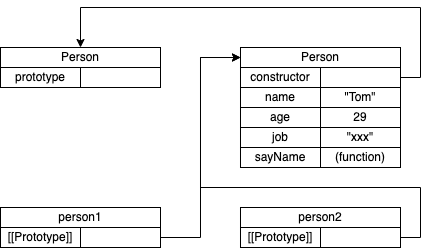

# 对象

## 创建对象

### 工厂模式

工厂模式是一种众所周知的设计模式，有着广泛的应用，用于抽象创建特定对象的过程。

```javascript
function createPerson (name, age, job) {
    let o = new Object()
    o.name = name
    o.age = age
    o.job = job
    o.sayName = function () {
        console.log(this.name)
    }
    return o
}

let person = createPerson('Tom', 18, 'Software Engineer')
```

### 构造函数模式

ECMAScript中的构造函数是用于创建特定类型对象的。像Object和Array这样的原生构造函数，运行时可以直接在执行环境中使用。

```javascript
function Person (name, age, job) {
    this.name = name
    this.age = age
    this.job = job
    this.sayName = function () {
        console.log(this.name)
    }
}

let person1 = new Person('Tom', 18, 'Software Engineer')
let person2 = new Person('Jerry', 18, 'Software Engineer')
person1.sayName()            // "Tom"
person2.sayName()            // "Jerry"
```

`Person`为自定义的构造函数，按照惯例，构造函数的首字母是要大写的，非构造函数则以小写字母开头。

#### new 操作符

要创建`Person`的实例，应使用`new`操作符。会执行如下操作：

1. 在内存中创建一个新对象
2. 这个新对象内部的[[Prototype]]特性被赋值为构造函数的prototype属性。
3. 构造函数内部的`this`被赋值为这个新对象
4. 执行构造函数内部的代码（给新对象添加属性）
5. 如果构造函数返回非空对象，则返回该对象；否则，返回刚创建的对象。

在实例化时，如果不想传参数，那么构造函数后面的括号可以不加。

#### 构造函数的问题

构造函数的主要问题在于，其定义的方法会在每个实例上都创建一遍。对于前面的例子而言，`person1`和`person2`都有名为`sayName`的方法，但这两个方法不是同一个Function实例。

```javascript
console.log(person1.sayName === person2.sayName)        // false
```

### 原型模式

每个函数都会创建一个`prototype`属性，这个属性是一个对象，包含应该由特定引用类型的实例共享的属性和方法。实际上，这个对象就是通过调用构造函数创建的对象的原型。使用原型对象的好处是，在他上面定义的属性和方法可以被对象实例共享。原来在和构造函数中直接赋给对象实例的值，可以直接赋值给他们的原型。

```javascript
function Person () {}

Person.prototype.name = 'Tom'
Person.prototype.age = 29
Person.prototype.job = "xxx"
Person.prototype.sayName = function () {
    console.log(this.name)
}

let person1 = new Person()
person1.sayName()       // Tom

let person2 = new Person()
person2.sayName()       // Tom

```

`Person`构造函数、`Person`的原型对象和`Person`现有两个实例之间的关系。

<div align=center></div>

可以使用`isPrototypeOf`来判断实例和构造函数之间的关系：

```javascript
console.log(Person.prototype.isPrototypeOf(person1))        // true
console.log(Person.prototype.isPrototypeOf(person2))        // true
```

ECMAScript的Object类型有一个方法叫`Object.getPrototypeOf()`，可以方便的获取一个对象的原型。

```javascript
console.log(Object.getPrototypeOf(person1) === Person.prototype)        // true
console.log(Object.getPrototypeOf(person1).name)                       // "Tom"
```

Object类型还有一个`setPrototypeOf()`方法，可以向实例的私有特性`[[Prototype]]`写入一个新值。这样就可以重写一个对象的原型继承关系：

```javascript
let biped = {
    numLegs: 2
}

let person = {
    name: 'Matt'
}

Object.setPrototypeOf(person, biped)

console.log(person.name)                                //  Matt
console.log(person.numLegs)                             //  2
console.log(Object.getPrototypeOf(person) === biped)     //  true

```

`setPrototypeOf`可能会严重影响代码性能，修改继承关系的影响都是微妙且深远的。这种影响并不仅是执行`Object.setPrototypeOf()`语句那么简单，而是会涉及所有访问了那些修改过`[[Prototype]]`的对象的代码。

为了避免使用`setPrototypeOf`造成的性能下降，可以通过`Object.create()`来创建一个新对象，同时为其指定原型：

```javascript
let biped = {
    numLegs: 2
}

let person = Object.create(biped)
person.name = 'Matt'

console.log(person.name)                                //  Matt
console.log(person.numLegs)                             //  2
console.log(Object.getPrototypeOf(person) === biped)     //  true
```

#### 原型层级

在通过对象访问属性时，会按照这个属性的名称开始搜索。搜索开始于对象实例本身。如果在这个实例上发现了给定的名称，则返回该名称对应的值。如果没有找到这个属性，则搜索会沿着指针进入原型对象，然后 在原型对象上找到属性后，再返回对应的值。这就是多个实例之间共享属性和方法的原理。

虽然可以通过实例读取原型对象上的值，但不可能通过实例重写这些值。如果在实例上添加了一个与原型对象中同名的属性，那就会在实例上创建这个属性，这个属性会遮住原型对象上的属性。

#### 原型和in操作符

in操作符会在可以通过对象访问指定属性时返回true，无论该属性是在实例上还是在原型上。

判断某个属性是否位于原型链上

```javascript

function hasPrototypePrototype(object, name) {
    return !object.hasOwnProperty(name) && (name in object)
}

```

`hasOwnProperty()`只有属性存在于实例上才会返回true。

在`for-in`循环中使用`in`操作符时，可以通过对象访问且可以被枚举的属性都会返回，包括实例属性和原型属性。

要获取对象上所有可枚举的`实例属性`，可以使用`Object.keys()`方法。

```javascript
function Person() {}

Person.prototype.name = 'Jack'
Person.prototype.age = 18
Person.prototype.job = 'Software Engineer'
Person.prototype.sayName = function () {
    console.log(this.name)
}

let keys = Object.keys(Person.prototype)

```

想要列出所有实例属性，无论是否可以枚举，都可以使用`Object.getOwnPropertyNames()`

在ECMAScript新增了Symbol类型之后，因为以Symbol为键的属性没有名称的概念。因此，`Object.getOwnPropertySymbols()`方法出现了。

```javascript
let k1 = Symbol('k1')
let k2 = Symbol('k2')

let o = {
    [k1]: 'k1',
    [k2]: 'k2'
}

console.log(Object.getOwnPropertySymbols(o))            // [Symbol(k1), Symbol(k2)]
```

#### 属性枚举的顺序

`for-in`循环和`Object.keys()`的枚举顺序是不确定的，取决于JavaScript引擎，可能因浏览器而差异

`Object.getOwnPropertyNames()`、`Object.getOwnPropertySymbols()`和`Object.assign()`的枚举顺序是确定的。先以升序枚举数值键，然后以插入顺序枚举字符串和Symbol。在字面量中定义的键以他们逗号分隔的顺序插入。

```javascript
let k1 = Symbol('k1'),
    k2 = Symbol('k2')

let o = {
    1: 1,
    first: 'first',
    [k1]: 'sym1',
    second: 'second',
    0: 0
}

o[k2] = 'sym2'
o[3] = 3
o.third = 'third'
o[2] = 2

console.log(Object.getOwnPropertyNames(o))
//  ['0', '1', '2', '3', 'first', 'second', 'third']

console.log(Object.getOwnPropertySymbols(o))
//  [Symbol(k1), Symbol(k2)]
```
